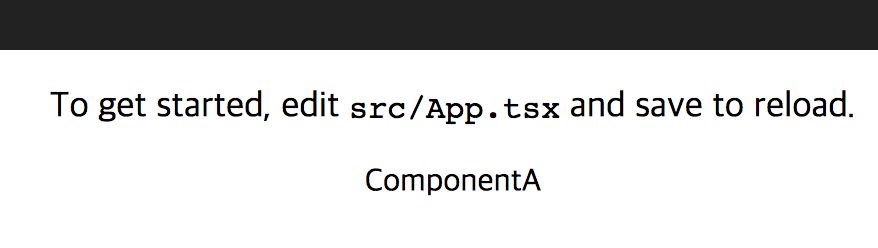

# typescript-monorepo-cra-example

> 🙉 TypeScript Monorepo Sample  
Required TypeScript@3 above

## Create monorepo with create-react-app

### Prerequisition
`create-react-app`, `yarn`

### Create monorepo
```bash
$ create-react-app typescript-monorepo/packages/react-app --react-scripts=react-scripts-ts
$ cd typescript-monorepo
$ rm -r packages/react-app/node_modules
```

- create [package.json](package.json)
- create [packages/tsconfig.json](packages/tsconfig.json)
- create [packages/tsconfig.base.json](packages/tsconfig.base.json)

### Create component

- create [packages/component-a](packages/component-a) - 3 files

### Edit react-app

- edit packages/react-app/src/App.tsx
  - [packages/react-app/src/App.tsx](packages/react-app/src/App.tsx#L4)
  - [packages/react-app/src/App.tsx](packages/react-app/src/App.tsx#L18)
- edit [packages/react-app/package.json](packages/react-app/package.json#L9)

```bash
$ yarn
$ yarn build:packages
$ yarn start
```

### 👌


